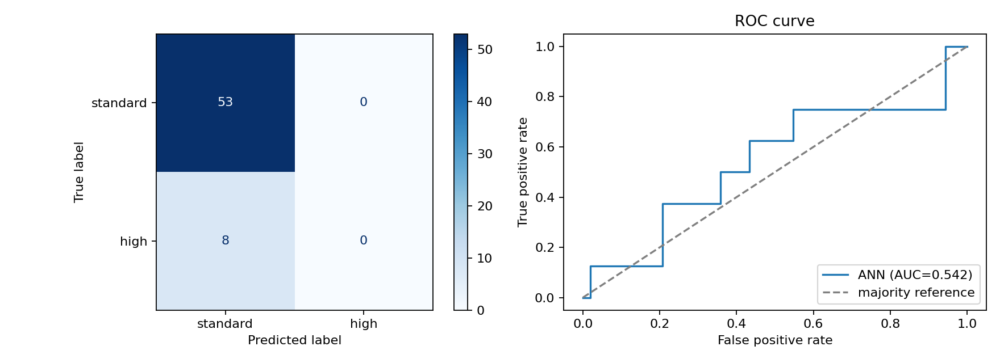

# ANN Binary Classification

An artificial neural network trained on the Car Dekho dataset to classify vehicle transmission type.

## Dashboard

[Open the full evaluation dashboard](ann_dashboard.html)

The model achieved 86.9% test accuracy, matching the majority-class baseline. Because the test set contains no correctly identified Automatic vehicles, accuracy should be interpreted alongside the class balance and ROC-AUC of 0.542.

## Project Files

- `ann_binary_classification.py` - training and evaluation script
- `ann_dashboard.html` - local HTML evaluation dashboard
- `ann_artifacts/evaluation.png` - confusion matrix and ROC curve
- `ann_artifacts/metrics.txt` - saved evaluation metrics